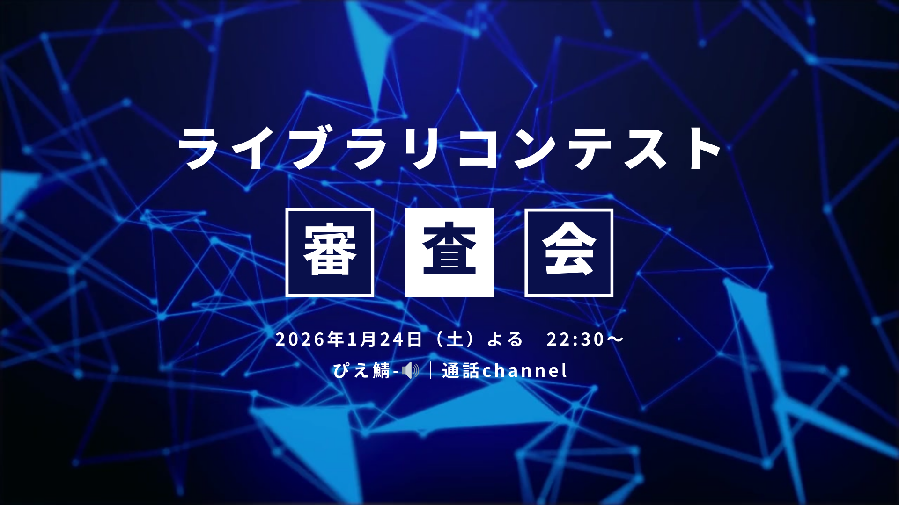

---
PageName: "プログラミングコンテスト審査会のお知らせ"
PageTitle: "プログラミングコンテスト審査会のお知らせ"
PageAbstract: "ぴえ鯖でプログラミングコンテストの審査会を開催します！"
PageImg: "/assets/news9.png"
PageTag: "ぴえ鯖"
PageUpdateDay: "2026/1/19"
important: true
top: true
news: true
--- 
## プログラミングコンテスト審査会のお知らせ
先日開催したプログラミングコンテストの審査会を以下の日程で開催します。  
2026年1月24日（土） よる 22:30    
Discordの「ぴえ鯖-🔊｜通話」チャンネルにて実施します。

審査会には、成果物を提出していない方も参加可能です。  
審査会では、参加者の皆さんの提出物を一つずつ紹介し、その場でコードレビューを行います。  
マイクオフでも参加可能なので、ぜひお気軽にご参加ください。  
  
ぴえ鯖への参加はこちら  
[https://discord.gg/kt9zDUhn8z](https://discord.gg/kt9zDUhn8z)